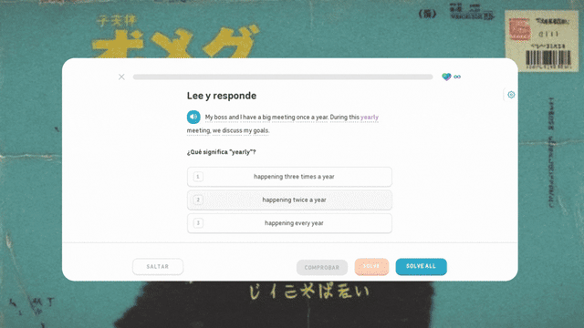
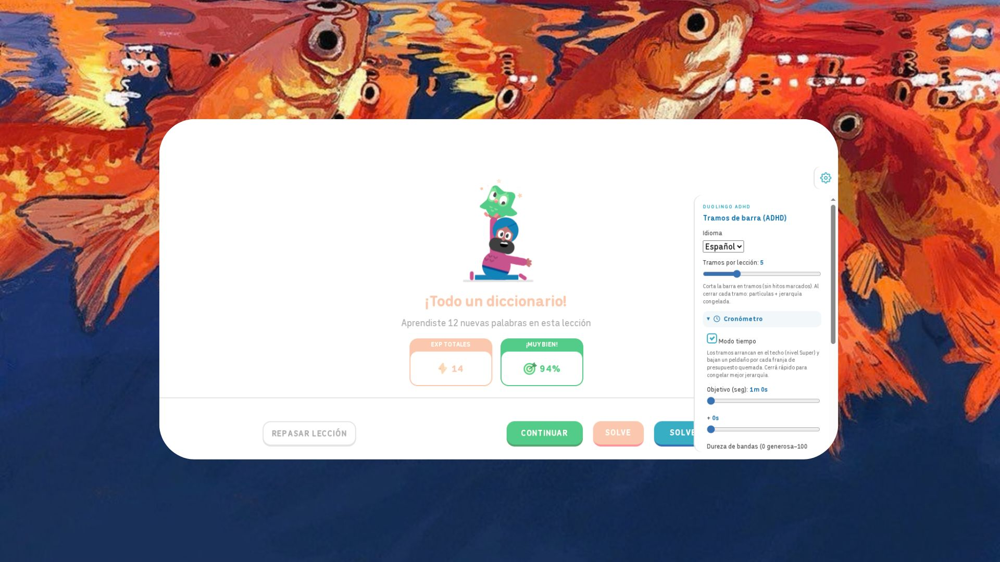

# Duolingo ADHD — Progress bar milestones (for the easily distracted / bored)

---

## What it is

Duolingo's progress bar is one long, uniform line. When you have trouble staying with something for long stretches, that line gives you almost nothing to hold onto: no landmarks, no sense of "I closed a chunk", no feedback on pace.

**Duolingo ADHD** splits that bar into segments and turns each one into a small reward loop:

- The bar becomes a **sequence of segments** instead of one continuous sweep.
- Each segment carries a **material tier** — Wood → Bronze → Silver → Streak → Diamond → **Super** — with its own texture, colour and signature animation.
- In **timer mode** (on by default) every segment starts at the top tier and **decays while you take too long on it**. Answer fast and you freeze a better tier. The tier you land on gets recorded in the bar, so your lesson ends up looking like a record of how you actually did.
- A **continuous rail** above the bar shows how much budget is left and which tier you're currently on track to reach.

## Who it's for, and what it actually does

**If you struggle with consistency.** A uniform bar has no milestones, so there's no moment to acknowledge. Segments give you one every few seconds, and closing one fires particles in that segment's colour. It's the difference between watching a line and working through a series of small completions.

**If you tend to lose focus on long, uniform tasks.** The per-segment timer turns "be faster" from a vague intention into a concrete, short-horizon target: finish *this* segment before the tier drops. You get one piece of feedback every few seconds instead of an end-of-lesson score.

**If you like seeing progress accumulate.** The local journal tracks lessons, segments, average time per segment and your streak of days — all stored in your browser, never uploaded.

**What this script is not.** It is not a clinical tool, it does not measure or diagnose attention, and it is not a substitute for treatment, therapy or professional planning. It is a cosmetic and pacing layer over Duolingo's own bar, for personal use. If a feature would help you, [suggest it](#suggestions).

## The material

Three recordings, in order, taken in a real lesson:

**1. A segment in progress** — the rail at the top of the bar, the tier label, the chronometer, and the settings tab docked to the right edge.

**2. A full lesson** — 2m40s of the whole system working, including a segment that turns red when the budget runs out.

<video controls preload="none" width="100%" style="max-width:720px;border-radius:12px">
  <source src="demo.mp4" type="video/mp4">
  Your browser does not support embedded video — <a href="demo.mp4">download demo.mp4</a> instead.
</video>

**3. The settings panel**, open over a finished lesson (the panel's UI is bilingual):

## Configuration

Open the settings panel with the **tab docked to the right edge** of the screen. Everything applies live — no reload needed.

### Configuration (English)

| Control | Default | What it does |
|---|---|---|
| **Language** | your browser locale | Language of the settings panel UI (`es` / `en`). |
| **Segments per lesson** | **5** (4 separators) | How many pieces the bar is split into. 2–13. Fewer = longer chunks; more = more frequent feedback. |
| **Timer mode** | **on** | Per-segment time budget with tier decay. Turn it off to get the plain positional tier ladder with no clock. |
| **Goal (sec)** | **10m 0s** | Total time budget per segment. Every segment gets the same budget, so the goal slider is what makes the whole ladder harder or easier. |
| **+ seconds** | **0s** | Fine adjustment on top of the minutes, in 5s steps. |
| **Band hardness** | **35%** | 0 = generous (wide safety margin at the top tiers), 100 = strict (narrow margins, tiers drop fast). This is the main difficulty dial. |
| **Reward effects** | **on** | Full-screen celebration when a segment is closed on a high tier: **Streak** → animated flames, **Diamond** → faceted crystals, **Super** → a shower of Duo. Lower tiers keep the particle burst only. |
| **Test effects** | — | Cycles all six bursts and the lost state on the live bar, so you can tune the look without waiting. |
| **Local journal** | **off** | Starts counting lessons, segments, average time, day streak and total lessons. Off by default; nothing is recorded until you enable it. |
| **Reset values** | — | Restores all defaults (keeps your chosen language). |

**Turning timer mode off** is the thing to try first if the decay feels punishing: you keep the segmented bar and the tier textures, and lose only the clock and the rail.

### Configuración (español)

| Control | Por defecto | Qué hace |
|---|---|---|
| **Idioma** | el locale del navegador | Idioma de la interfaz del panel (`es` / `en`). |
| **Tramos por lección** | **5** (4 separadores) | En cuántos trozos se divide la barra. 2–13. Menos = trozos más largos; más = feedback más seguido. |
| **Modo tiempo** | **activado** | Presupuesto de tiempo por tramo con decaimiento de peldaño. Si lo apagás queda la escalera posicional de tiers, sin cronómetro. |
| **Objetivo (seg)** | **10m 0s** | Presupuesto total por tramo. Todos los tramos reciben el mismo, así que este slider es lo que hace la escalera más fácil o más difícil. |
| **+ segundos** | **0s** | Ajuste fino sobre los minutos, en pasos de 5s. |
| **Dureza de bandas** | **35%** | 0 = generosa (mucho margen arriba), 100 = exigente (márgenes angostos, los peldaños caen rápido). Este es el dial principal de dificultad. |
| **Efectos de recompensa** | **activado** | Celebración a pantalla completa al cerrar un tramo de peldaño alto: **Racha** → llamas animadas, **Diamante** → cristales facetados, **Super** → lluvia de Duo. Los peldaños bajos conservan solo las partículas. |
| **Probar efectos** | — | Cicla los seis bursts y el estado perdido sobre la barra real, para que puedas ver los efectos sin esperar. |
| **Diario local** | **desactivado** | Empieza a contar lecciones, tramos, tiempo medio, racha de días y lecciones totales. Apagado por defecto; no se registra nada hasta que lo actives. |
| **Restablecer valores** | — | Vuelve todo a los valores por defecto (conserva el idioma que elegiste). |

**Lo primero para probar si el decaimiento te parece muy duro:** apagá el **modo tiempo**. Conservás la barra segmentada y las texturas de los peldaños; perdés solo el cronómetro y el riel.

## Roadmap

Planned, in order:

1. **Sound.** Short, tasteful feedback on tier changes and closed segments. Opt-in, off by default, and no sound that can get grating on repeat.
2. **UX improvements.** Continued polish on the rail, the panel and how the decay reads at a glance.
3. **More features in other areas.** Beyond the progress bar.

Suggestions for any of these are welcome — see below.

## Scope, privacy and affiliation

- **A personal userscript, not an official product.** Made by one person, for personal use, in the context of language learning. Not affiliated with, endorsed by, or supported by Duolingo.
- **Nothing leaves your browser.** There is no server, no account and no analytics. Your settings and journal live in the userscript manager's local storage and stay on your machine. Clearing the script's storage deletes them permanently.
- **The only network request** the script makes is fetching the Baloo 2 font used by the chronometer, and it fails gracefully to a system font if that request is blocked.
- **The reward effects are self-contained.** The three celebration effects are bundled canvas animations with no external requests; the Super effect embeds a small sprite of the Duo character that you supplied.
- It is released under the [MIT license](LICENSE). Use it, fork it, adapt it.

## Install

**1. Install a userscript manager** — [Tampermonkey](https://www.tampermonkey.net/), Violentmonkey, or Greasemonkey.

**2. Install the script** from Greasy Fork:

> **https://greasyfork.org/es-419/scripts/590127**

**3. Open any lesson or practice session** on Duolingo. The bar segments itself. Click the tab on the right edge to change settings.

The script updates itself through Greasy Fork once installed.

## Suggestions

Suggestions are genuinely welcome — that's most of what the roadmap is made of. If something feels off, confusing, or you want a dial that doesn't exist yet, open an issue on the repository.

Useful things to include: what you were doing, what you expected, what happened instead, and your browser plus Duolingo's UI language. If it's a visual thing, a screenshot helps a lot.

## License

MIT — see `LICENSE`.
