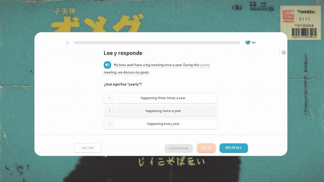
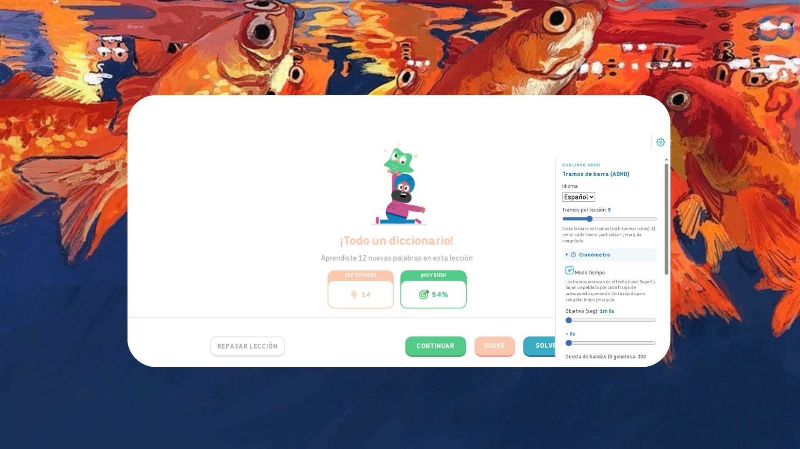

# Duolingo ADHD — Progress bar milestones (for the easily distracted / bored)

<div align="center">

[](LICENSE)
[](https://www.tampermonkey.net/)
[](https://greasyfork.org/es-419/scripts/590127)
[](https://greasyfork.org/es-419/scripts/590127-duolingo-adhd-progress-bar-milestones-for-the-easily-distracted-bored)

</div>



---

## What it is

Duolingo's progress bar is one long, uniform line. When you have trouble staying with something for long stretches, that line gives you almost nothing to hold onto: no landmarks, no sense of "I closed a chunk", no feedback on pace.

**Duolingo ADHD** splits that bar into segments and turns each one into a small reward loop:

- The bar becomes a **sequence of segments** instead of one continuous sweep.
- Each segment carries a **material tier** — Wood → Bronze → Silver → Streak → Diamond → **Super** — with its own texture, colour and signature animation.
- In **timer mode** (on by default) every segment starts at the top tier and **races you down the ladder while you take too long on it**. Answer fast and you freeze a better tier. The tier you land on gets recorded in the bar, so your lesson ends up looking like a record of how you actually did.
- A **continuous rail** above the bar shows how much budget is left in the current lap and which tier you're on track to reach.
- The ladder moves in **laps, not continuously**: the rail holds one tier for the whole lap, and every time it runs out it recharges **one tier lower** — Super → Diamond → Streak → Silver → Bronze → Wood. The tier you freeze is the one the rail was showing **at the moment you closed**, not the best one you brushed against earlier.
- **You never lose.** Wood is the floor, laps keep counting, and there is no failure state to fall into: running long simply costs you tiers. The segments are a record that pushes you to finish the lesson, not an exam with a trick question.

## Who it's for, and what it actually does

**If you struggle with consistency.** A uniform bar has no milestones, so there's no moment to acknowledge. Segments give you one every few seconds, and closing one fires particles in that segment's colour. It's the difference between watching a line and working through a series of small completions.

**If you tend to lose focus on long, uniform tasks.** The per-segment timer turns "be faster" from a vague intention into a concrete, short-horizon target: finish *this* segment before the tier drops. You get one piece of feedback every few seconds instead of an end-of-lesson score.

**If you like seeing progress accumulate.** The local journal tracks lessons, segments, average time per segment and your streak of days — all stored in your browser, never uploaded.

**What this script is not.** It is not a clinical tool, it does not measure or diagnose attention, and it is not a substitute for treatment, therapy or professional planning. It is a cosmetic and pacing layer over Duolingo's own bar, for personal use. If a feature would help you, [suggest it](#suggestions).

## The material

Three recordings, in order, taken in a real lesson:

**1. A segment in progress** — the rail at the top of the bar, the tier label, the chronometer, and the settings tab docked to the right edge.


**2. A full lesson** — 2m40s of the whole system working, including a segment that turns red when the budget runs out.

<video controls preload="none" width="100%" style="max-width:720px;border-radius:12px">
  <source src="demo.mp4" type="video/mp4">
  Your browser does not support embedded video — <a href="demo.mp4">download demo.mp4</a> instead.
</video>

**3. The settings panel**, open over a finished lesson (the panel's UI is bilingual):



## Configuration

Open the settings panel with the **tab docked to the right edge** of the screen. Everything applies live — no reload needed.

### Configuration (English)

| Control | Default | What it does |
|---|---|---|
| **Language** | your browser locale | Language of the settings panel UI (`es` / `en`). |
| **Segments per lesson** | **5** (4 separators) | How many pieces the bar is split into. 2–13. Fewer = longer chunks; more = more frequent feedback. |
| **Timer mode** | **on** | Per-segment time budget with the tier ladder racing you down. Turn it off to get the plain positional tier ladder with no clock. |
| **Goal (sec)** | **10m 0s** | Time budget per lap. This is the only difficulty dial: a shorter goal means laps run out faster and the ladder drops more tiers within the same segment. |
| **+ seconds** | **0s** | Fine adjustment on top of the minutes, in 5s steps. |
| **Reward effects** | **on** | Full-screen celebration when a segment is closed on a high tier: **Streak** → animated flames, **Diamond** → faceted crystals, **Super** → a shower of Duo. Lower tiers keep the particle burst only. |
| **Test effects** | — | Cycles all six bursts and the lost state on the live bar, so you can tune the look without waiting. |
| **Animations** | **respect system** | Follows the desktop's reduced-motion setting. Set it to **always** to force every effect on, or **never** to calm them all down. Affects this script only — it never changes your OS settings. Toggling it applies live. |
| **Tier sounds** | **on** | A short sound every time a segment closes, matched to the tier you froze: satisfying on **Streak / Diamond / Super**, unpleasant on **Wood / Bronze / Silver**. Each tier has its own cue. |
| **Periodic reminder** | **on** | Repeats a soft reminder while duolingo.com is open, **on any screen**. It only sounds when you are **not focused on the page** — 45 s without interacting, or the tab hidden — so it never interrupts you mid-lesson. It never plays catch-up when you come back. |
| **Every** | **1m** | Interval for the reminder: 15 s – 15 min in 15 s steps (the label shows it as `45s`, `1m`, `5m 30s`). |
| **Test sound** | — | Plays the reminder cue immediately. Clicking it also unlocks audio for the browser, which blocks all sound until you interact with the page. |
| **Local journal** | **off** | Starts counting lessons, segments, average time, day streak and total lessons. Off by default; nothing is recorded until you enable it. |
| **Reset values** | — | Restores all defaults (keeps your chosen language). |

**Turning timer mode off** is the thing to try first if the ladder feels punishing: you keep the segmented bar and the tier textures, and lose only the clock and the rail.

### Configuración (español)

| Control | Por defecto | Qué hace |
|---|---|---|
| **Idioma** | el locale del navegador | Idioma de la interfaz del panel (`es` / `en`). |
| **Tramos por lección** | **5** (4 separadores) | En cuántos trozos se divide la barra. 2–13. Menos = trozos más largos; más = feedback más seguido. |
| **Modo tiempo** | **activado** | Presupuesto de tiempo por tramo con la escalera de peldaños bajándote. Si lo apagás queda la escalera posicional de tiers, sin cronómetro. |
| **Objetivo (seg)** | **10m 0s** | Presupuesto de cada vuelta. Es el único dial de dificultad: menos tiempo = las vueltas se agotan antes y la escalera baja más peldaños dentro del mismo tramo. |
| **+ segundos** | **0s** | Ajuste fino sobre los minutos, en pasos de 5s. |
| **Efectos de recompensa** | **activado** | Celebración a pantalla completa al cerrar un tramo de peldaño alto: **Racha** → llamas animadas, **Diamante** → cristales facetados, **Super** → lluvia de Duo. Los peldaños bajos conservan solo las partículas. |
| **Probar efectos** | — | Cicla los seis bursts y un escalón a la baja sobre la barra real, para que puedas ver los efectos sin esperar. |
| **Animaciones** | **respetar sistema** | Sigue la preferencia de movimiento reducido del escritorio. Ponela en **siempre** para forzar todos los efectos, o en **nunca** para calmarlos. Afecta solo a este script: nunca cambia la configuración del sistema operativo. Se aplica al instante. |
| **Sonidos por peldaño** | **activado** | Un sonido corto cada vez que se cierra un tramo, con el peldaño que congelaste: satisfactorio en **Racha / Diamante / Super**, desagradable en **Madera / Bronce / Plata**. Cada peldaño tiene su propio sonido. |
| **Recordatorio periódico** | **activado** | Repite un aviso suave mientras duolingo.com está abierto, **en cualquier pantalla**. Solo suena cuando **no estás usando la página** — 45 s sin interacción, o la pestaña oculta — así nunca te interrumpe en plena lección. Al volver no repite lo perdido. |
| **Cada cuánto** | **1m** | Intervalo del recordatorio: de 15 s a 15 min, en pasos de 15 s (el rótulo lo muestra como `45s`, `1m`, `5m 30s`). |
| **Probar sonido** | — | Suena el recordatorio al toque. El click además desbloquea el audio, que el navegador retiene hasta que interactúas con la página. |
| **Diario local** | **desactivado** | Empieza a contar lecciones, tramos, tiempo medio, racha de días y lecciones totales. Apagado por defecto; no se registra nada hasta que lo actives. |
| **Restablecer valores** | — | Vuelve todo a los valores por defecto (conserva el idioma que elegiste). |

**Lo primero para probar si la escalera te parece muy dura:** apagá el **modo tiempo**. Conservás la barra segmentada y las texturas de los peldaños; perdés solo el cronómetro y el riel.

## Sound

The script ships two kinds of sound, both controlled from **Settings → Sound**:

- **A tier fanfare on every closed segment.** It plays in the same instant as the particle burst and the tier freeze. The three high tiers (Streak, Diamond, Super) sound satisfying; the three low tiers (Wood, Bronze, Silver) sound deliberately unpleasant — the same split as the full-screen reward effects. With timer mode off no tier is evaluated, so there is no fanfare.
- **A periodic reminder while duolingo.com is open.** Default interval **60 s**, configurable from 15 s to 15 min. It does not depend on the lesson bar: it plays on **any screen**, and only when you are idle — no interaction for 45 s, or the tab hidden — so it never interrupts an active lesson. If it falls due while you are focused it waits, and coming back from a hidden tab plays at most one reminder, never a backlog.

Each one has its own toggle, and with everything off the script keeps no timer and prepares no audio at all.

**Browser autoplay.** Chrome and Firefox block all sound until you interact with the page at least once. The first click or key press unlocks it — the **Test sound** button does exactly that. If a cue is still blocked, it is dropped silently and the lesson keeps going: sound never blocks or breaks anything.

**No network requests.** The seven cues are embedded in the script as base64 `data:` URIs, so they load instantly, work offline and can't be blocked by an extension.

### Desktop notification when the tab is hidden

A reminder that falls due while the tab is **in the background** escalates to a **system notification**. The reason is structural: the browser throttles a hidden tab's timers down to about one wake per minute, so a page-scheduled sound cannot reach you on time — but the operating system's notification channel can. The notification is silent in itself; if the page's audio is alive, the script's own cue sounds along with it, so the notice doesn't depend on your OS volume.

- It's the **userscript manager** (Tampermonkey), never duolingo.com, that shows the notification — the site is never asked for a notification permission, and no prompt is ever attributed to it.
- It ships **on by default**, like the sounds. One click in **Settings → Sound** turns it off; with it off, a hidden reminder simply waits and plays at most once when you come back — exactly as before this feature existed.
- In managers without `GM_notification` (Violentmonkey, Greasemonkey, Safari), the toggle degrades silently to that same old behaviour: nothing breaks, the reminder stays pending until you return.

**If nothing shows even with the toggle on**, the OS is almost always the one silencing it — and the panel says so: the Sound section shows a red note when the last notification wasn't delivered. How to unblock it:

- **GNOME / Linux:** *Settings → Notifications* — turn off **Do Not Disturb** and make sure notifications are enabled for your browser. On minimal setups with no notification daemon (some window managers), install and enable one (`mako`, `dunst`) — nothing can be shown without it.
- **Windows:** *Settings → System → Notifications* — notifications on, and check that **Focus Assist / Do Not Disturb** is not suppressing them, and that your browser isn't in the per-app block list.
- The browser itself can block them too: in `chrome://settings/content/notifications`, the userscript manager's entry must not be blocked.

### Replacing a sound (ElevenLabs prompts)

Every cue has two interchangeable sources, in this order:

1. the embedded sample in `SOUND_SAMPLES` (inside `duolingo-adhd.user.js`), and
2. a built-in synthesizer recipe in `SOUND_SYNTH`, always present as the fallback.

To swap in a sound you generate yourself:

1. Generate the SFX with the matching prompt below (ElevenLabs SFX works, so does any other generator). Short, no voice, no music bed.
2. Trim it and export **mono MP3**, e.g. with ffmpeg — this cuts at 1.6 s and fades the last 0.3 s so a long cue can't cover the next segment closing:

   ```bash
   ffmpeg -i cue.wav -af "atrim=0:1.6,afade=t=out:st=1.3:d=0.3" -ac 1 -ar 22050 -c:a libmp3lame -b:a 40k cue.mp3
   ```
3. Turn it into a data URI:

   ```bash
   echo -n "data:audio/mpeg;base64,$(base64 -w0 cue.mp3)"
   ```
4. In `duolingo-adhd.user.js`, find `const SOUND_SAMPLES = {` and paste the entire string as the value for that cue's key (`super`, `diamante`, `racha`, `plata`, `bronce`, `madera`, `reminder`).
5. Stay inside the budget: **≤ ~20 KB of base64 per cue, ≤ ~100 KB in total** (the seven shipped samples are ~70 KB together). If one doesn't fit, shorten it or set the value to `''` — the synthesizer takes over for that cue.

Nothing else changes: the trigger, the panel and the tests only care about the cue id.

**The prompts used for the shipped samples:**

| Cue | Character | Prompt |
|---|---|---|
| `super` | satisfying, the finale | *Short rewarding game reward jingle, ascending four-note sparkle arpeggio, bright bell and soft chime blend, triumphant but not loud, clean tail, 0.6 seconds, no voice, no music bed* |
| `diamante` | satisfying, crystalline | *Single bright crystal chime, glassy bell hit with a fast shimmering decay, premium and satisfying, 0.5 seconds, no voice, no music bed* |
| `racha` | satisfying, quick | *Quick three-tone rising arcade blip, playful and positive, snappy attack, 0.35 seconds, no voice, no music bed* |
| `plata` | unpleasant, flat | *Dull flat two-tone buzzer, slightly detuned and anticlimactic, unimpressed sound, 0.4 seconds, no voice, no music bed* |
| `bronce` | unpleasant, dull | *Low dull thud with a short filtered noise scrape, heavy and disappointing, 0.3 seconds, no voice, no music bed* |
| `madera` | unpleasant, ugly on purpose | *Descending wobbly low woodblock wobble, clumsy and comical failure sound, cheap and scratchy, 0.45 seconds, no voice, no music bed* |
| `reminder` | a nudge, not an alarm | *Two soft dry woodblock knocks, gentle attention-getting tick-tock, calm and non urgent, 0.35 seconds, no voice, no music bed* |

The shipped samples are trimmed to ≤ 1.9 s and normalised to **-16 LUFS / -2 dBTP**, so all seven sit at the same perceived volume. If you generate your own, match them by ear or with `ffmpeg -af ebur128`.

## Verification

Verification is split on purpose so that development never has to run a browser on the maintainer's machine:

- **Locally**: `npm test` — the unit suite only (`npm run test:core`, Node, ~0.4 s, no browser). It is the red→green loop.
- **In GitHub Actions** (`.github/workflows/ci.yml`): the unit suite, the mutation harness (`npm run mutate`) and the headless-browser check (`npm run test:e2e`), as three separate steps on a pinned runner image (`ubuntu-24.04`). The heavy layers run **only** there.
- **Before pushing** (the one check that needs files outside the repo): `npm run test:vendor` — unzip + diff of the three third-party modules against their reference archives (~1 s, no browser). It is not a workflow step because those archives are not tracked.
- **Flow**: work goes on a branch and is opened as a pull request; a change counts as verified when that pull request's run is green on every layer. Nothing is pushed to `master` directly.

## QA de campo (field QA)

The automated harness (core + e2e) validates the published file against a frozen fixture — a replica of duolingo.com as captured on one date. The real site drifts, and those bugs are found on the real site. Field QA is the stage that closes that loop:

1. **Guion per change.** Every change ends with `qa/guion-<change>.html` — a form (`qa/plantilla-guion.html` is the machinery) with one question per scenario of the change plus a fixed smoke section, to run against the real duolingo.com.
2. **Evidence via the QA companion.** `qa/adhd-qa-helper.user.js` is a local, never-published userscript the tester installs alongside: it captures page-level runtime errors and copies a diagnostics block (errors, script DOM artifacts, motion) to paste as evidence. It uses no `GM_*` and makes no network requests.
3. **Report as a gate.** The filled guion exports `qa/reports/<change>-campo.md` (Markdown + front matter: `change`, `version`, `fecha`, `resultado`, `fallas`). **No change is archived without its report** — `resultado: pass`, or an explicit `resultado: skip` with the reason.
4. **Failures become tracked work.** A FALLA on the change's own questions reopens its tasks; a FALLA on the smoke section outside its scope becomes a new field-bug change citing the report.

The published userscript ships none of this — the guion and the companion live in `qa/`, tracked like `test/`, and the script file stays untouched.

## Roadmap

Planned, in order:

1. **UX improvements.** Continued polish on the rail, the panel and how the lap ladder reads at a glance.
2. **More features in other areas.** Beyond the progress bar.

Suggestions for any of these are welcome — see below.

## Scope, privacy and affiliation

- **A personal userscript, not an official product.** Made by one person, for personal use, in the context of language learning. Not affiliated with, endorsed by, or supported by Duolingo.
- **Nothing leaves your browser.** There is no server, no account and no analytics. Your settings and journal live in the userscript manager's local storage and stay on your machine. Clearing the script's storage deletes them permanently.
- **The reminder's desktop notification is local too.** It is emitted by the userscript manager (`GM_notification`), not by duolingo.com: the site is never asked for a notification permission, no permission prompt is attributed to it, and nothing about you or your session leaves the browser — the operating system only ever receives the short text you see on screen.
- **The only network request** the script makes is fetching the Baloo 2 font used by the chronometer, and it fails gracefully to a system font if that request is blocked.
- **The sounds are self-contained.** The seven cues (tier fanfare + reminder) are embedded in the script file itself as `data:` URIs; no audio is downloaded, ever.
- **The reward effects are self-contained.** The three celebration effects are bundled canvas animations with no external requests; the Super effect embeds a small sprite of the Duo character that you supplied.
- It is released under the [MIT license](LICENSE). Use it, fork it, adapt it.

## Install

**1. Install a userscript manager** — [Tampermonkey](https://www.tampermonkey.net/), Violentmonkey, or Greasemonkey.

**2. Install the script** from Greasy Fork:

> **https://greasyfork.org/es-419/scripts/590127**

**Heads-up:** when you install (or update to) a version with the desktop reminder, Tampermonkey asks once for the **notifications permission** — that's the manager asking, not duolingo.com. Allow it if you want reminders to reach you while the tab is in the background; denying it simply leaves the audible-only path.

**3. Open any lesson or practice session** on Duolingo. The bar segments itself. Click the tab on the right edge to change settings.

The script updates itself through Greasy Fork once installed.

## Suggestions

Suggestions are genuinely welcome — that's most of what the roadmap is made of. If something feels off, confusing, or you want a dial that doesn't exist yet, open an issue on the repository.

Useful things to include: what you were doing, what you expected, what happened instead, and your browser plus Duolingo's UI language. If it's a visual thing, a screenshot helps a lot.

## License

MIT — see `LICENSE`.
